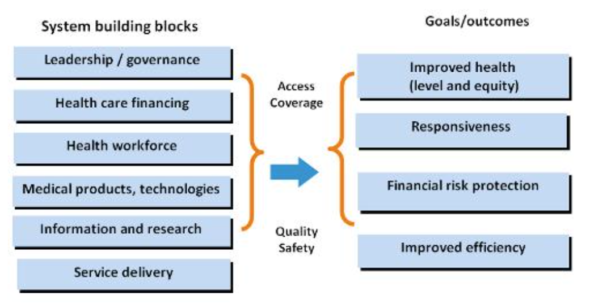

Do you have a lot of goals to achieve? 

Can't you decide which to focus on? 

Are your resources limited? 

Would you like to know which is the best set of goals to aim for and which actions do you need to achieve them?

Then... **Xtrategy** would help you with it.

## HOW TO...

The steps below is a quick guide on how to use the tool. 

Steps 1 and 2 are realted to the definition of the problem and data collection.

Step 3 involves the use of tool with which you would be able to analyze your results and built the most efficient Strategy.

###STEP 1: List of Interventions to achieve and possible actions to support it

The first thing you need is a list of all those goals you would like to achieve and another list of all the possible actions and effort that would be needed in order to achieve them.

Our aim is to evaluate those goals not only against the outcomes that they would lead to, but also against how difficult it is to achieve them and how many actions are required.

The criteria we will evaluate the goals against are base on the WHO's building blocks framework:

###STEP 2: Experts Survey##

The second step is to generate the neccesary surveys in order to get the evaluation data from experts on the area. 

If you have a big amount of information, it is suggested that you split it into different blocks (for instance, Prevention, Diganostic, Treatment...). 

For the surveys to be robust it is recomended not to have more than around 10 interventions per block.

The followings are the Survey's used for the Bolivia project:

Block 1 https://es.surveymonkey.com/r/QBP5QZG

Block 2 https://es.surveymonkey.com/r/WXVWRF3

Block 3 https://es.surveymonkey.com/r/QL2HCQ3

Block 4 https://es.surveymonkey.com/r/WPLXHFB

###STEP 3: Analyse the results##

Once you have all your results back you will need to provide them in a matrix form to the program to be able to read and interpret them. We call this a performance matrix.

You can download an example of the template filled with dummy data here: **CLICK HERE TO DOWNLOAD AN EXCEL TEMPLATE**

Once you have filled up the template you are ready to use the program!

**Data Settings**

There you can upload the file with your Performace Matrixes and Actions survey results. You will also need to enter some specific parameters regarding your data. Once that is completed, click on "Compute Results" and wait for the program to calculate the outputs. 

**Analysis**

Once the programm has gone to all the data and computed the neccesary measures the Analysis tab will be populated. Here you will be able to have a look at the results of each individual intervention/goal that you want to achieve. You can also see by each of the blocks you have and in two dimensional graphs to easily understand the overall results.

At the end, you will also get a table that shows the ranking of the actions. This is based on how many interventions those each action support. 

Once you have understood the trends and individual results you can start constructing you Xtrategy using the iterative tool.

**Strategy Constuction**

Here you will be able to gradually add Interventions to you Xtrategy until you get to a scenario in which you believe it is completed.

The first thing you will see its the scenario at Iteration 0. Obviously this means there are no Interventions in your Xtrategy are therefore the Outputs and Complesxity are null and Interventions and Actions tables are empty.

What you will get the whole list on "Possible Interventions to Add". There you can choose the first Intervention(s) you want to add to your strategy by clicking on them in the table and clicking "Add Interventions to the Strategy". You can use the table filters to modify what you see on the right hand side graph.

Once a new Iteration is computed, you will be able to see the situation at that point and have again the ability to add more Interventions.

